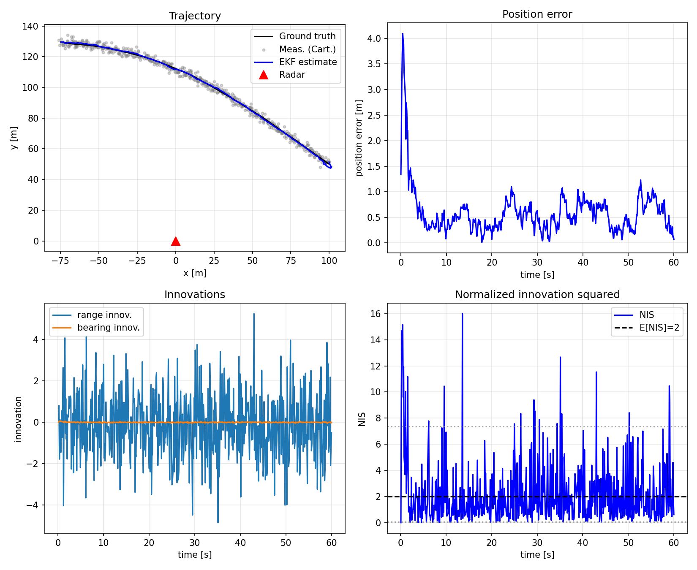
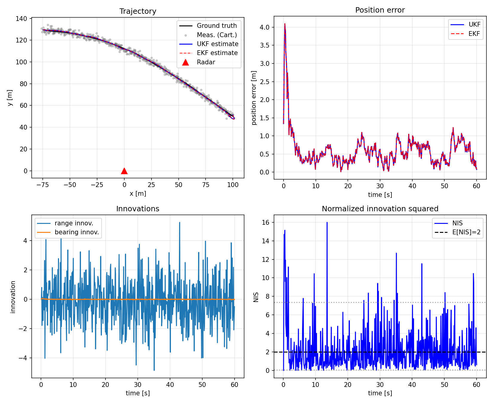
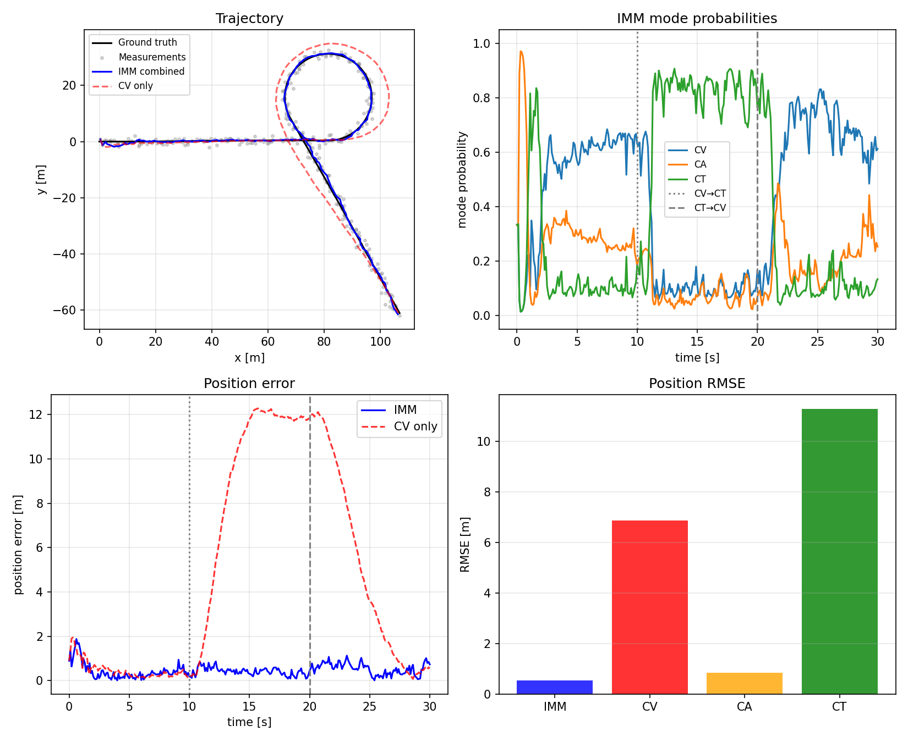

## State Estimation and Tracking

Python and MATLAB prototypes for Kalman-filter state estimation and tracking. Stage 0
uses synthetic scenarios only, so setup and smoke tests do not require KITTI data.

## Setup

From the repository root:

```bash
python3 -m venv .venv
source .venv/bin/activate
python -m pip install --upgrade pip
python -m pip install -r prototypes/python/requirements.txt
```

The Python prototype dependencies are constrained in
`prototypes/python/requirements.txt` to keep major-version behavior stable while
allowing compatible patch updates.

## Run Python Prototypes

Each command writes generated figures and reference exports to `prototypes/output/`.
That directory is local output and is intentionally ignored by git.

```bash
python prototypes/python/linear_kf.py
python prototypes/python/ekf_synthetic.py
python prototypes/python/ukf_synthetic.py
python prototypes/python/imm_synthetic.py
```

## Test and Smoke-Check

Stage 0 tests are synthetic-only and should run without KITTI. A fresh environment can
verify importability and execute the Stage 0 smoke path with:

```bash
python -m pytest prototypes/python/tests
python -m compileall prototypes/python
python prototypes/python/linear_kf.py
python prototypes/python/ekf_synthetic.py
python prototypes/python/ukf_synthetic.py
python prototypes/python/imm_synthetic.py
```

Expected checks include NEES/NIS consistency messages for the KF/EKF/UKF scripts and
IMM RMSE/mode-switch DOD messages for the IMM script.

## MATLAB Parity Verification

Run the Python prototypes first because the MATLAB scripts load the `.mat` reference
exports generated in `prototypes/output/`. Then run, from the repository root:

```bash
matlab -batch "addpath('prototypes/matlab'); linear_kf; ekf_synthetic; ukf_synthetic; imm_synthetic"
```

Each MATLAB script reports a Python/MATLAB max-error parity check and writes any
MATLAB-generated plots to `prototypes/output/`.

## KITTI Data Policy

KITTI data is not required for Stage 0. Keep downloaded datasets local and out of git:

- `data/kitti_raw/` for KITTI Raw
- `data/kitti_tracking/` for KITTI Tracking
- `data/cache/` for generated loader caches such as processed `.npz` streams

Those paths are ignored in `.gitignore`. Do not commit KITTI archives, extracted
sequences, generated dataset indexes, processed `.npz` streams, or local replay caches.

Stage 1 KITTI prototypes use local KITTI Raw OXTS with `pykitti`, convert
first-frame-origin WGS84 lat/lon/alt to ENU, and cache processed arrays under
`data/cache/`. Stage 0 tests must remain runnable without KITTI data.

## Stage 1.1 KITTI Loader

The KITTI loader uses local KITTI Raw OXTS data only. KITTI archives and extracted
sequences must stay under ignored local data paths and must not be committed.

Install the Python prototype dependencies from the repository root:

```bash
python -m pip install -r prototypes/python/requirements.txt
```

Download KITTI Raw data from the official login/download page:
https://www.cvlibs.net/datasets/kitti/raw_data.php

For the initial loader sequence, extract the `2011_09_26` raw data under:

```text
data/kitti_raw/2011_09_26/
```

The documented smoke sequence is `2011_09_26_drive_0001_sync`. Run the loader with:

```bash
python prototypes/python/kitti_loader.py --root data/kitti_raw --date 2011_09_26 --drive 0001
```

The loader writes deterministic cache files under `data/cache/` and plot output under
`prototypes/output/`. Pure unit tests run without KITTI data; the integration test
skips unless the local KITTI Raw sequence exists.

## Stage 1.2 Frame Plumbing

Stage 1.2 defines the localization frame contract used by the Python KITTI filters:

- `map`: local ENU frame with origin at the first valid GPS fix.
- `base_link`: vehicle body frame, FLU convention.
- `imu_link`: KITTI OXTS/IMU frame; colocated with `base_link` by default in Stage 1.
- `gps_link`: GPS measurement point; colocated with `base_link` by default in Stage 1.
- `velo_link`: Velodyne frame from KITTI `calib_imu_to_velo.txt`.

GPS and IMU lever arms are configurable even though the Stage 1 default uses zero offsets.
This keeps the later ESKF GPS measurement model ready for nonzero antenna offsets without
inventing unsupported KITTI metadata.

## Stage 1.3 High-Rate OXTS Requirement

The synced KITTI Raw folders (`*_sync`) expose OXTS at about 10 Hz. They are useful for
loader validation, frame tests, low-rate GPS/pose references, and trajectory plots, but
they are not sufficient for the Stage 1.3 strapdown mechanization or Stage 1.4 ESKF
predict step.

Before Stage 1.3, install the unsynced/high-rate KITTI Raw OXTS drive under:

```text
data/kitti_raw/<date>/<date>_drive_<drive>_extract/oxts/
```

If only `*_sync` data is present, the high-rate setup guard raises a clear blocking
error instead of silently treating 10 Hz OXTS as high-rate IMU data.

## Linear CV Kalman filter


## Radar EKF (synthetic)

Trajectory, position error, innovations, and NIS from `prototypes/python/ekf_synthetic.py`.



## Radar UKF (synthetic)

Same scenario as EKF; Julier-scaled sigma points (α=1e-3, β=2, κ=0). EKF overlay on trajectory/error panels for comparison.



## IMM CV / CA / CT (synthetic)

Maneuvering target (CV → coordinated turn → CV) with IMM mixing CV-KF, CA-KF, and CT-UKF; position measurements.


