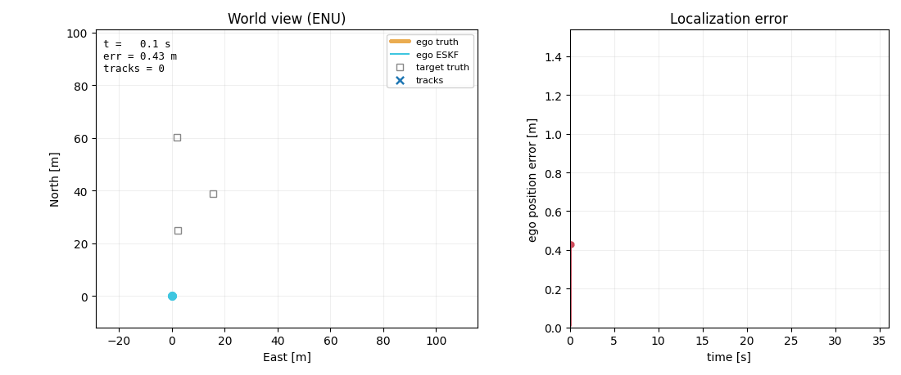
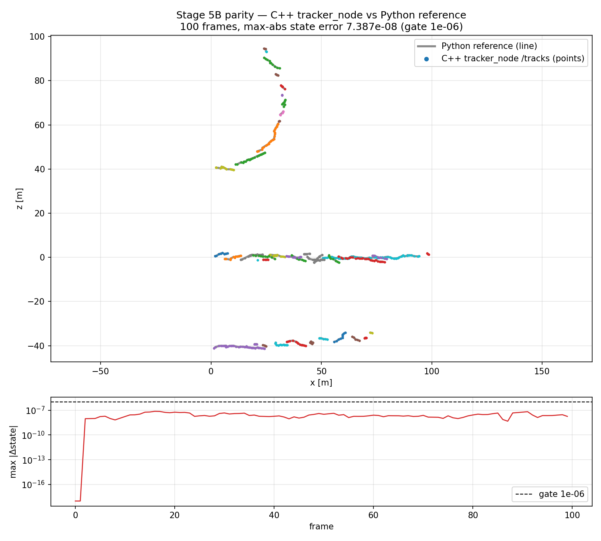
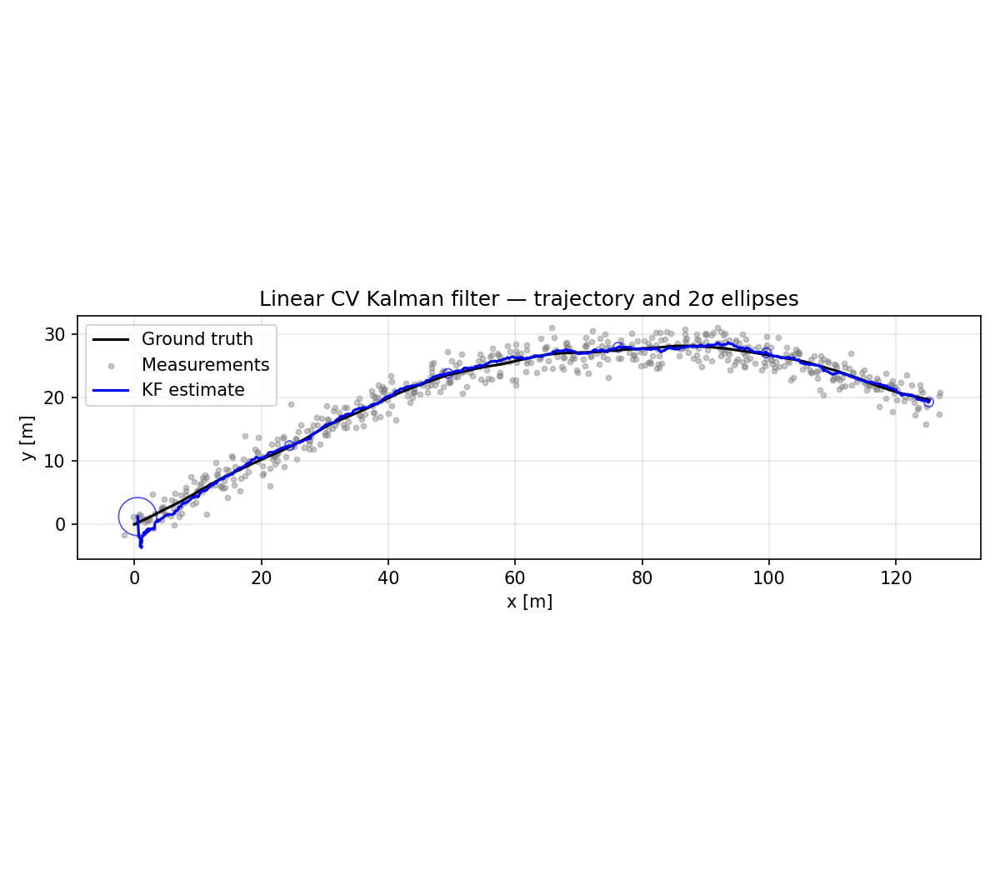
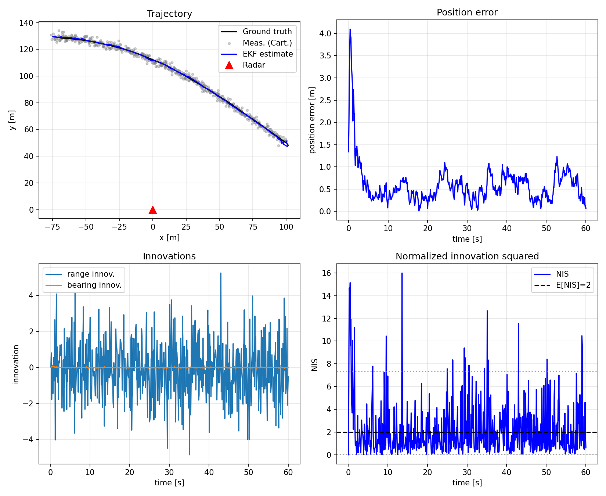
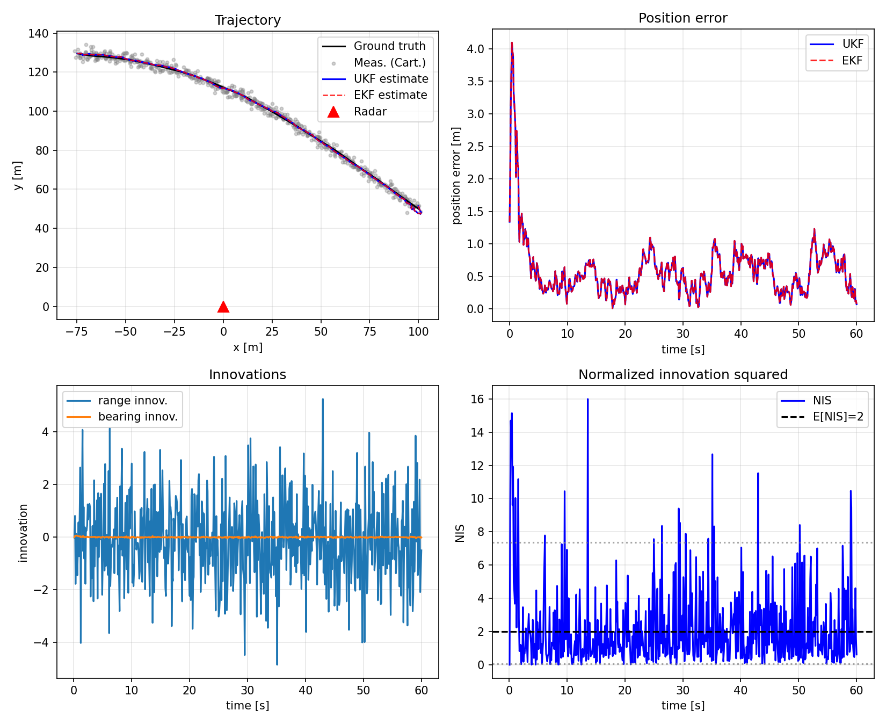
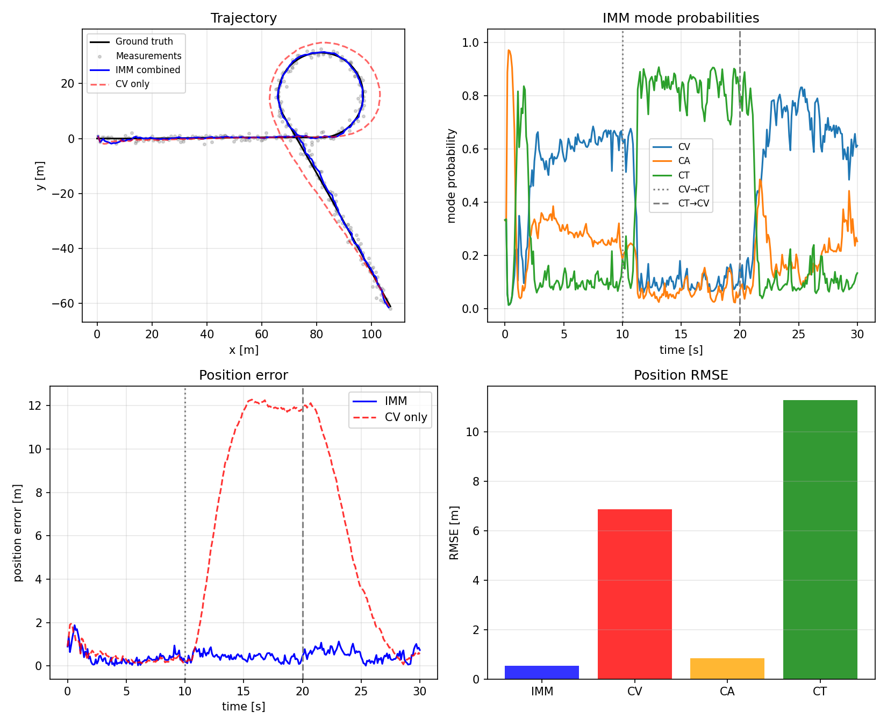
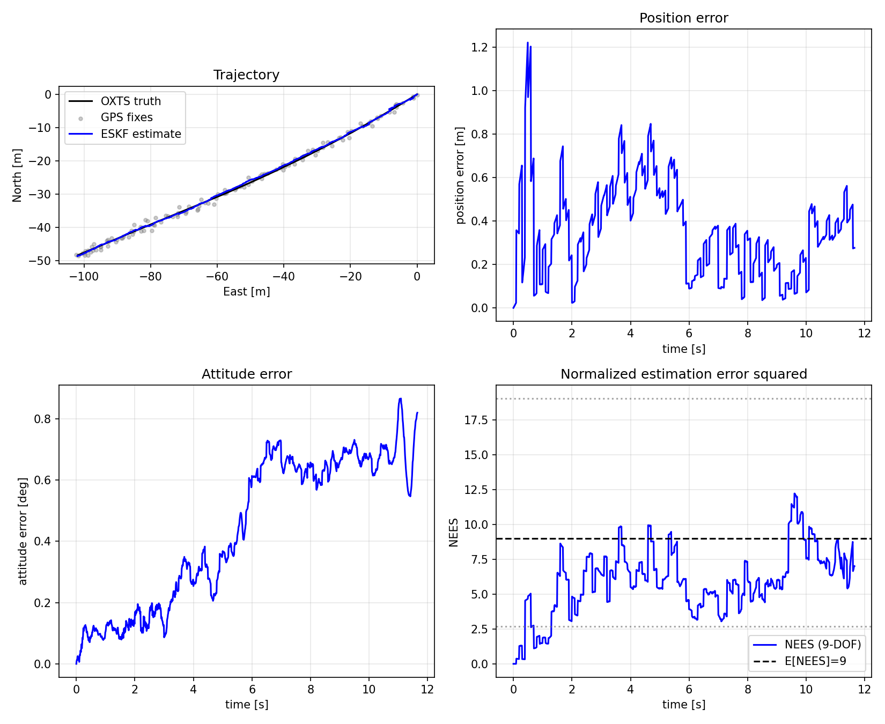
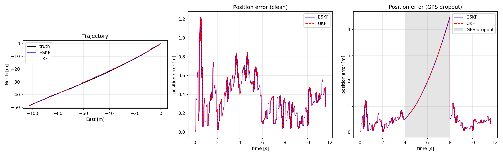

# State Estimation and Tracking

A localization and multi-object tracking stack for autonomous vehicles, in C++ and ROS 2, validated
on KITTI. A 15-state error-state Kalman filter fuses IMU and GPS to localize the ego vehicle; an
IMM tracker (CV / CA / CT) follows other objects. The two are **coupled** — detections are placed in
the world using the filter's own pose estimate, so localization error propagates into tracking error
instead of being hidden by an oracle pose.



*Amber is the OXTS reference trajectory, cyan is the filter estimate; right panel is live position
error. Rendered from a recorded run, not screen-captured.*

## Results

Eight KITTI Raw sequences, 544 s and 6.6 km. ATE and RPE are unaligned 3D translation errors in
metres. Every reported **ATE** is computed twice — once by
[`evo`](https://github.com/MichaelGrupp/evo) and once by this repo's own implementation — and the run
fails if they disagree by more than 1e-6; all 32 checks agreed. RPE is computed only by this repo,
not cross-checked.

| Sequence | Dur (s) | ATE | GPS-only | RPE | NEES in band |
|---|---:|---:|---:|---:|---:|
| 2011_09_26_0001 | 11.7 | 0.567 | 1.310 | 0.583 | 94.1% |
| 2011_09_26_0009 | 27.6 | 0.449 | 1.288 | 0.597 | 94.3% |
| 2011_09_26_0015 | 31.3 | 0.436 | 1.264 | 0.475 | 95.8% |
| 2011_09_26_0117 | 36.1 | 0.472 | 1.263 | 0.613 | 94.7% |
| 2011_09_30_0020 | 113.6 | 0.503 | 1.305 | 0.497 | 94.2% |
| 2011_09_30_0033 | 166.0 | 1.013 | 1.293 | 0.547 | 56.4% |
| 2011_10_03_0042 | 121.9 | 0.575 | 1.298 | 0.391 | 87.1% |
| 2011_09_29_0004 | 35.9 | 0.448 | 1.274 | 0.531 | 95.2% |
| **mean** | | **0.558** | **1.287** | | |

**The filter is 2.31× better than the GPS fixes it is given**, and is statistically consistent on
six of eight sequences (94–96% of steps inside the 95% χ² band).

That baseline deserves scrutiny, so here is the uncomfortable version. `ate_gps_only` is ~1.29 m on
every sequence because it is essentially √3 × 0.75 m — it restates the injected noise and says
nothing about the data. A non-causal 11-tap moving average over the same fixes does better than the
filter, scored at the GPS epochs:

| mean ATE (m) | raw GPS | ESKF | centred MA(11) |
|---|---:|---:|---:|
| | 1.289 | 0.537 | **0.412** |

The smoother wins on all eight. It is not a competing estimator — it uses ±0.5 s of **future**
measurements, which nothing running on a vehicle can. That is the difference between smoothing and
filtering, and it makes the MA an offline lower bound rather than an alternative: a causal estimator
landing within ~30% of it is the meaningful statement, not the 2.31×.

The comparison earns its keep on `0033`, where the smoother wins by 2.4× (0.402 vs 0.959). A
model-free smoother is indifferent to a mis-tuned process-noise model, so that gap independently
corroborates the overconfidence diagnosed below.

It is *not* consistent on the two longest sequences. On `0033` (166 s) only 56.4% of steps fall in
the band: mean NEES is 13.5 against an expected 3.0, with 42.8% of samples *above* it — the filter
is **overconfident**, its covariance smaller than its true error. `0042` (122 s) is milder at 87.1%,
same direction. The noise parameters were tuned on an 11.7 s drive and reused unchanged; run fifteen
times longer, that model understates accumulated error. Retuning would invalidate every other number
here, so the limit is reported rather than papered over.

Tracking, on the 11-sequence AB3DMOT validation split at 3D-IoU 0.25:

| Detections | MOTA | IDF1 | ID switches |
|---|---:|---:|---:|
| PointRCNN, ungated | 0.042 | 0.619 | 31 |
| Ground truth (ceiling) | 0.886 | 0.936 | 5 |

These are fixed-threshold figures; AB3DMOT's published Car result of MOTA 86.47 integrates over
score thresholds, so the two are measured differently and a direct win/loss reading is not valid.

The 0.042 is dominated by false positives — 8039 against their 368, while recall is 88.7% and misses
(1075) are within 40% of their 766. Two causes, both ours. Only the first is measured: no score gate
is applied, and gating at score ≥ 4 alone lifts MOTA to 0.660. The second — KITTI's DontCare and Van
ignore rules are not implemented, so objects the benchmark excludes are counted as false positives —
is *inferred*, not quantified: the only evidence is that the two negative-MOTA sequences are exactly
the two dominated by ignore-class objects (0013 has 55 Car boxes against 935 DontCare).

The ceiling row is the tracker's own limit, and it isn't perfect either: handed ground-truth boxes as
detections it still loses 11.4 MOTA points, with 739 misses, 347 false positives and 5 ID switches
out of 9550 boxes. M-of-N birth latency and `max_age` expiry are the likely causes. So 0.886 says the
tracker is sound, not that it is tuned.

## Failure modes

Six engineered experiments, each asserting a numeric signature and exiting non-zero if it fails.

| | |
|---|---|
|  |  |
| **GPS dropout** — ego drifts, tracks drift with it, both recover | **IMU bias** — the filter's bias estimate absorbs an injected offset |
|  |  |
| **Sudden maneuver** — IMM shifts weight from CV to CT | **Detection dropout** — the track coasts through a 1.1 s blackout |

The GPS-dropout run is what distinguishes a coupled system from two demos in one launch file: inside
the dropout window, per-frame track error correlates with ego position error at **r = 0.976** over 26
frames, slope 1.07 m per metre. Swapping the estimate for ground truth collapses r to −0.256, and
that seeded defect is caught by this gate alone.

One gate, `clutter`, **fails**, and is shown rather than omitted: Poisson clutter yields 8 confirmed
tracks against a baseline of 5 (limit 7) — two pure false tracks plus one re-birth of an existing
target under a new ID. The gate is untuned and recorded as a finding.


## Quickstart

Everything runs in Docker; no ROS install needed on the host.

```bash
git clone <this repo> && cd State-Estimation-And-Tracking
docker compose -f docker/docker-compose.yml build dev

# fetch KITTI OXTS -- HTTP range requests pull ~40 MB out of ~31 GB of archives
python3 scripts/fetch_kitti.py
python3 scripts/sanitize_oxts.py      # repair out-of-order OXTS timestamps

# build and test
docker compose -f docker/docker-compose.yml run --rm dev \
  bash -lc "cd /workspace/ros2_ws && colcon build && colcon test && colcon test-result --all"

# reproduce the results above (these two spawn Docker themselves / are pure Python)
python3 scripts/run_validation.py
python3 scripts/run_tracking_eval.py

# the failure-mode suite runs INSIDE the container -- it needs `ros2 launch`
docker compose -f docker/docker-compose.yml run --rm dev \
  bash -lc "python3 /workspace/scripts/run_failure_modes.py"
```

Live 3D view (Foxglove on the host, bridge in the container):

```bash
docker compose -f docker/docker-compose.yml run --rm --service-ports viz \
  bash -lc "cd /workspace/ros2_ws && source install/setup.bash && \
            ros2 launch kf_bringup full_pipeline.launch.py foxglove:=true"
```

Then open Foxglove, connect to `ws://localhost:8765`, and import
[`docs/foxglove/kitti_pipeline_layout.json`](./docs/foxglove/kitti_pipeline_layout.json).

## How it works

Four ROS 2 nodes, three topics:

```
 KITTI OXTS ──▶ pipeline_replay ──┬──▶ /imu/data ─┐
                                  └──▶ /gps/fix ──┴─▶ eskf_node (C++) ──▶ /ego/state
                                                                              │
              synthetic detections ──▶ detection_transform_node (C++) ◀───────┘
                                                     │
                                                     └──▶ tracker_node (C++) ──▶ /tracks
```

- **`eskf_node`** — 15-state error-state EKF, 100 Hz IMU strapdown with 10 Hz GPS updates,
  Joseph-form covariance update, publishes the full 15×15 covariance.
- **`detection_transform_node`** — the coupling. Pairs each detection frame with its ego pose by
  **exact timestamp**, never "most recent": the filter publishes `t_k` only when the IMU sample at
  `t_{k+1}` arrives, and the two topics race over different DDS paths.
- **`tracker_node`** — IMM over constant-velocity, constant-acceleration and coordinated-turn models
  (EKF for CV/CA, UKF for CT), 3D-IoU gating, Hungarian assignment, M-of-N track birth.

Every filter was written and validated in Python first, then ported to C++ against pinned reference
vectors. The tracker port agrees with its Python reference to **7.4e-08**:



## Honest limitations

- **GPS is synthesised from the OXTS reference** as `truth + N(0, 0.75 m)` at 10 Hz. ATE therefore
  measures fusion quality against the RTK solution, not against an independent survey — which is why
  the GPS-only baseline column is reported beside it.
- **Tracked targets in the coupled pipeline are synthetic**, anchored to the real ego path; KITTI Raw
  carries no tracklet labels.
- **The evaluation sequences are repaired.** Nearly every KITTI unsynced drive has out-of-order OXTS
  timestamps; restoring monotonicity costs 0.565% of samples (byte-identical duplicates). Drives with
  outages over 200 ms are split and only the longest segment is used — a bias in the filter's favour.
  Overall retention is 91.5%, but two drives retain 58.9% and 52.8%. Reported per sequence.
- **Not bit-reproducible** across runs; read digits as good to about three significant figures.
- The C++ UKF node is unported. It buys nothing here — ESKF and UKF ATE differ by at most 4e-4 m
  across all eight sequences.

## Notes

Longer notes on individual pieces live in [`docs/notes/`](./docs/notes/).

## Earlier prototypes

The C++ implementations were ported from Python references, each validated independently first.

| | |
|---|---|
|  |  |
| Linear constant-velocity KF | Radar EKF (synthetic) |
|  |  |
| Radar UKF (synthetic) | IMM CV / CA / CT (synthetic) |
|  |  |
| Error-state EKF on KITTI | UKF vs error-state EKF on KITTI |

## Repository layout

```
ros2_ws/src/kf_eskf/      15-state error-state EKF node (C++)
ros2_ws/src/kf_tracker/   IMM tracker + coupling node (C++)
ros2_ws/src/kf_bringup/   replay, metrics, launch, config (Python)
ros2_ws/src/kf_common/    shared filter math (C++)
ros2_ws/src/kf_msgs/      message definitions
prototypes/python/        reference implementations the C++ was ported against
scripts/                  fetch, repair, sweep, evaluation, plotting
docs/                     notes, figures, Foxglove layout
```

Test suite: **241 in-container test cases** — 119 C++ gtest plus 122 Python pytest, from a clean
rebuild. (`colcon test-result` prints 251 because it also counts 10 CTest wrapper entries that
re-count the same gtest binaries.) Plus 179 host-side prototype tests and 129 script tests.
