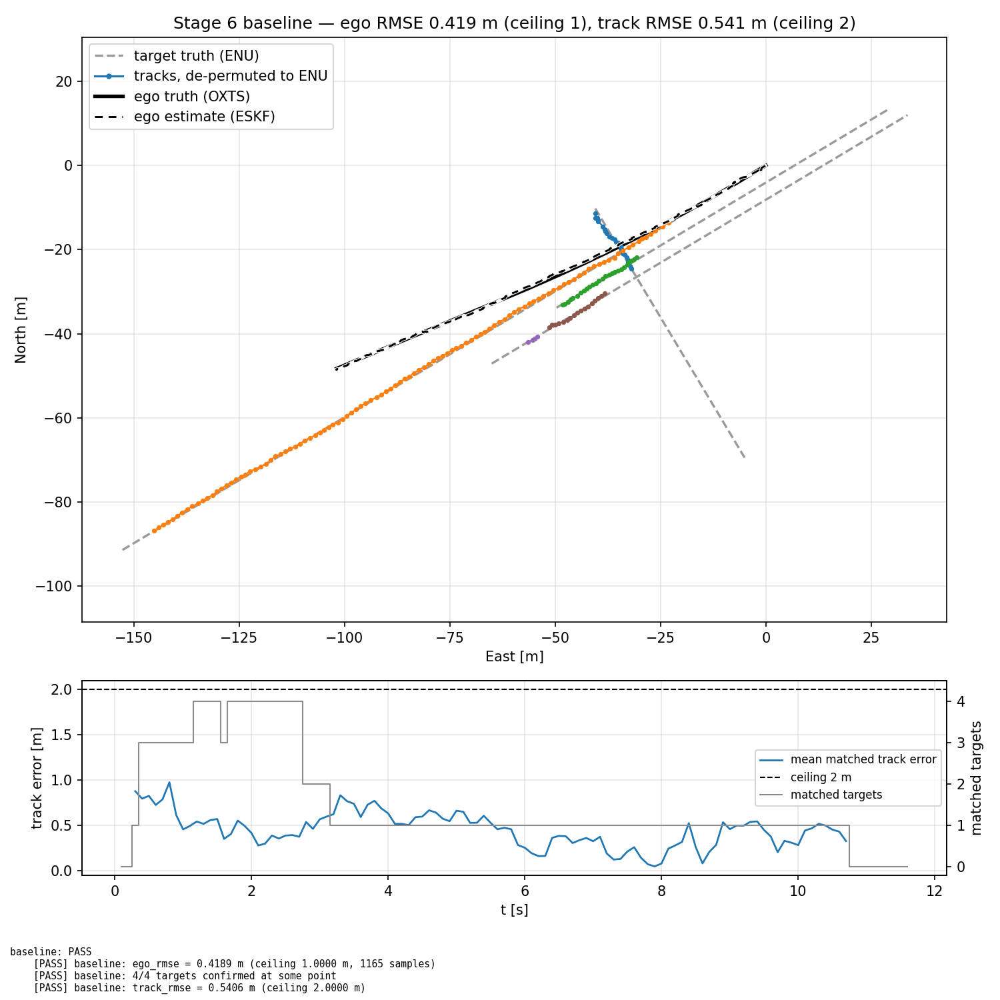
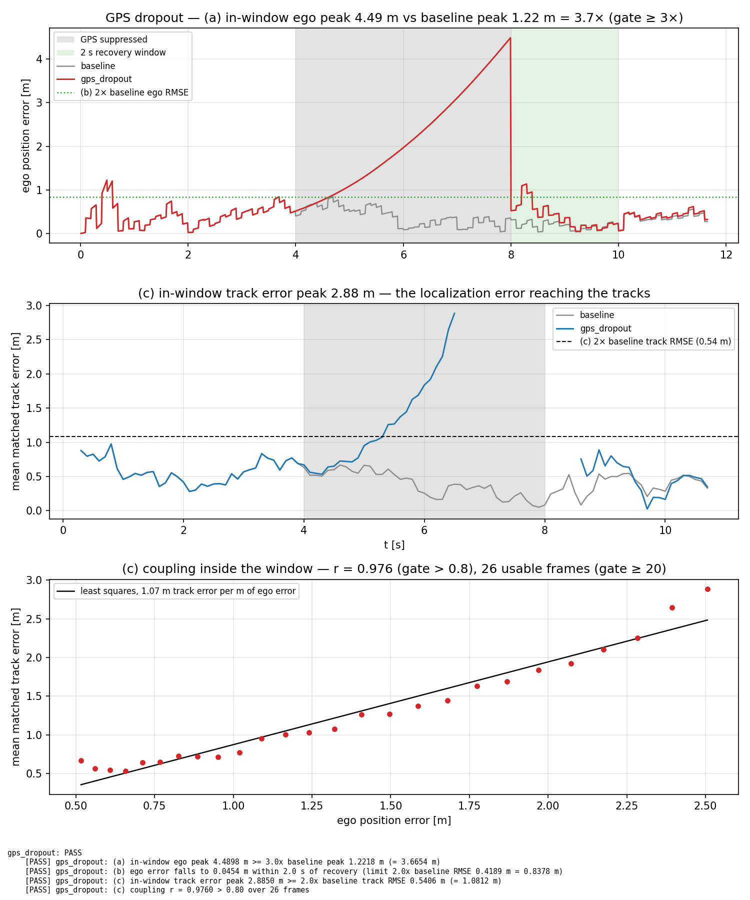
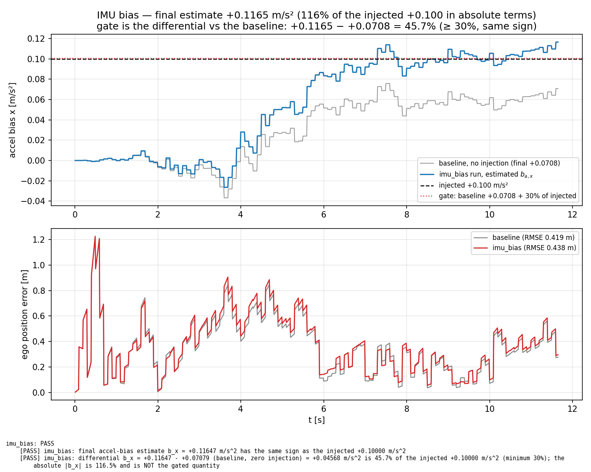
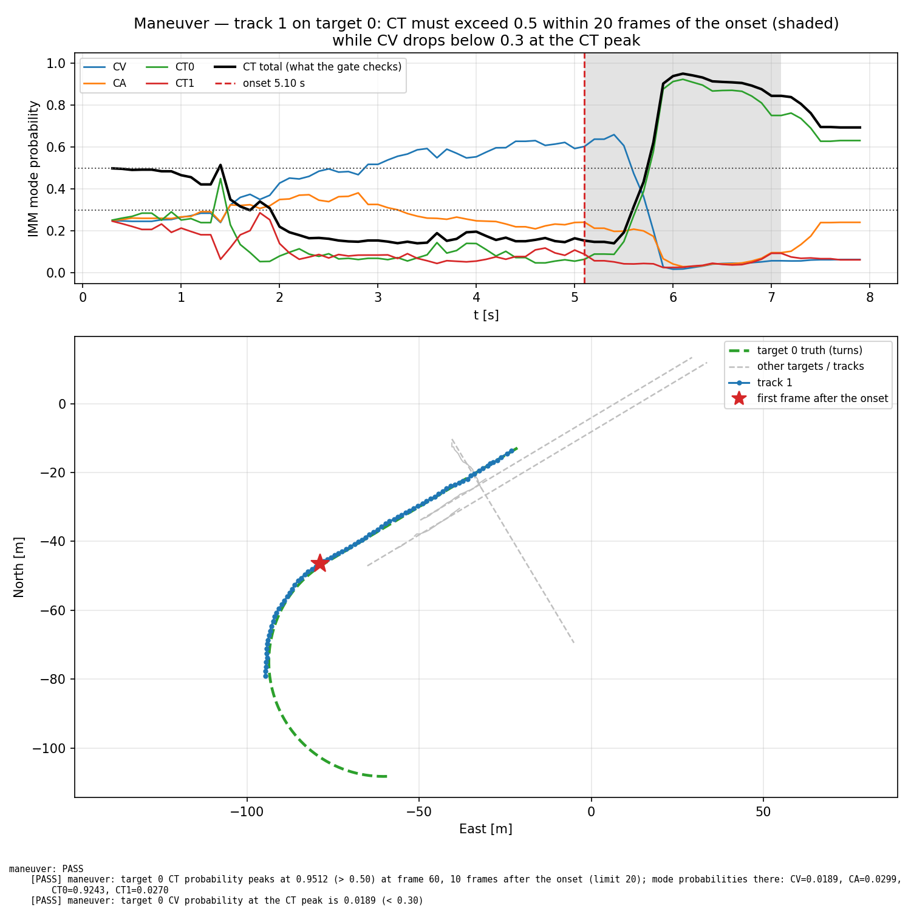
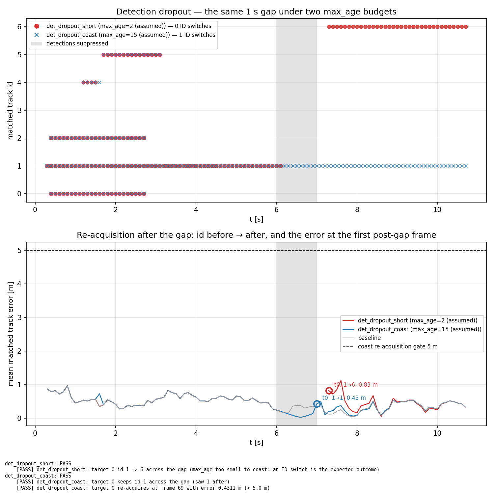
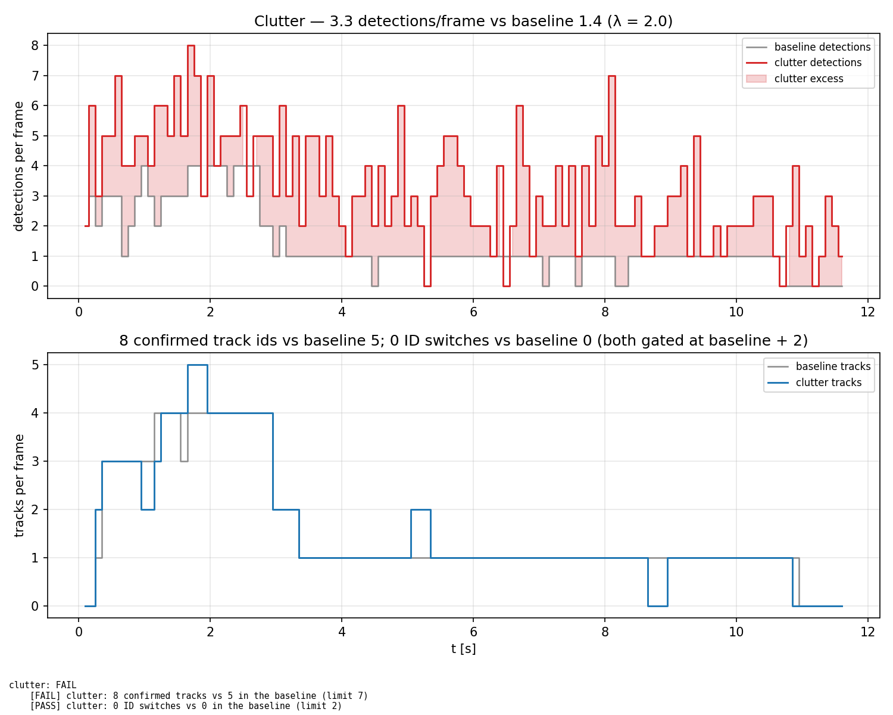

# End-to-End Pipeline and Failure-Mode Suite

The two halves of the project become one stack. Until now, `kf_eskf` answered "where am
I?" and `kf_tracker` answered "where are they?" in two unrelated launches. Here the ESKF's
ego estimate is the transform that converts `base_link` detections into world coordinates, so
**localization error lands in the object positions** — and then the pipeline is broken in five
engineered ways and the damage is measured.

## Setup

- **Ego data:** KITTI Raw `2011_09_26` drive `0001`, unsynced high-rate OXTS extract
  (1166 samples, 11.65 s, ~100 Hz). The same stream, the same seeded `sigma = 0.75 m` GPS, and
  the same `eskf_node` binary and config validated by the standalone ESKF parity gate.
- **Second OXTS extract, live view only — it feeds no gate on this page:**
  `2011_09_26_drive_0009_tail_extract` (2750 samples, 27.49 s, 148.6 m of 3D path — 148.4 m
  measured in the horizontal plane — and 91.6° between the minimum and maximum of the unwrapped
  yaw, a net 77.3° first-to-last heading change). It is the clean tail of drive `0009`, cut at
  that drive's sample 1930: drive `0009`'s own OXTS timestamps step *backward* by ~50 ms nine
  times between samples 1873 and 1924, and the tail after them is strictly monotonic. It exists
  because a longer path with a real corner is a better Foxglove demo than drive `0001`'s 11.65 s
  straight line. (This drive was called `drive_0091` while this suite was first built. It was
  renamed to `drive_0009_tail` because a real KITTI drive 0091 exists and the old name implied
  data we never used.)
- **Targets:** 4 synthetic KITTI-Car boxes (l=3.9, w=1.6, h=1.5 m) anchored to the *real* ego
  path — a lead vehicle, two oncoming, one crosser. KITTI Tracking is still not downloaded and
  `drive_0001` ships no tracklet labels, but synthetic targets are the better choice for this
  experiment anyway: target truth is exact, so the error a bad ego pose injects into track
  positions is *measurable*, not merely visible.
- **Detector model, per frame in fixed order:** FOV/range gate (90°, 60 m) → Bernoulli
  `p_detect=0.9` → `N(0, 0.35 m)` position noise → `N(0, 0.03 rad)` yaw noise → Poisson clutter
  → shuffle. `object_id = -1` always; the true source id is recorded but never published.
  116 detection frames at 10 Hz, 0.10–11.60 s.
- **Tracker:** `tracker_node` unchanged from the C++ port — `dt=0.1`, IMM bank `{CV, CA, CT+0.2,
  CT-0.2}`, 3D-IoU association (`iou_gate=0.01`, Hungarian), `min_hits=3`, `max_age=2`.

`eskf_node.cpp` and `tracker_node.cpp` are **not modified**. The coupling is a new standalone
node, and the tracker reaches the transformed stream by a launch-level remap
(`/detections` → `/detections_map`), so the tracker parity launch still exercises the same binary
and still reports `PARITY PASS` at `state_max_abs_err = 7.387e-08` (tol 1e-6).

```
pipeline_replay ──/imu/data, /gps/fix──► eskf_node ──/ego/state──┐
       │                                                          ▼
       └──/detections (base_link)────────► detection_transform_node
                                                          │ /detections_map (map_bev)
                                                          ▼
                                                     tracker_node ──/tracks──► recorder + gate
```

## Results

Seven runs, each asserting its own numeric signature and exiting non-zero on failure.
**Six PASS, one FAIL.**

| mode | injection | headline measurement | verdict |
|---|---|---|---|
| `baseline` | none | ego RMSE 0.4189 m, track RMSE 0.5406 m, 4/4 targets confirmed | PASS |
| `gps_dropout` | GPS cut 4–8 s | ego peak 4.4898 m; **coupling r = 0.9760** | PASS |
| `imu_bias` | +0.100 m/s² on body x | differential `b_x` 45.7% of injected | PASS |
| `maneuver` | target 0 → CT ω=0.4 rad/s at 5.1 s | CT probability 0.9512, 10 frames after onset | PASS |
| `det_dropout_short` | 1 s gap, `max_age=2` | id 1 → 6 (the expected ID switch) | PASS |
| `det_dropout_coast` | 1 s gap, `max_age=15` | id 1 preserved, re-acquires 0.4311 m off | PASS |
| `clutter` | λ = 2.0 | **8 confirmed ids vs baseline 5 (limit 7)** | **FAIL** |

The clutter failure was not tuned away. See "Clutter" below for what the three extra ids are.

## Frames

Three frames, and the permutation between the last two is the one place a silent bug can hide.

| frame | axes | carries |
|---|---|---|
| `base_link` | x forward, y left, z up (KITTI IMU/body) | `/detections` as published |
| ENU `map` | x East, y North, z Up | ESKF state, OXTS truth, target simulation |
| `map_bev` | x East, y **Down**, z North | `/detections_map`, `/tracks`, `/targets/truth` |

`map_bev` exists to reuse the `kf_tracker` kernel **unchanged**. That kernel is KITTI-camera
convention: BEV is the `(x, z)` pair, `y` points down, and a box occupies `[y-h, y]`. `map_bev`
is exactly the ENU frame written in that convention — the standard camera-vs-world relation,
not an invention. Making the tracker's BEV axes configurable instead would have touched
`box3d.hpp` and its gtests for a naming benefit, and put the tracker parity gate at risk.

Given the estimate `t̂`, `R̂ = R(q̂)` and a detection at `p_b` with yaw `ψ_b` about body z:

```
p_e   = R̂ p_b + t̂                          ψ_e   = ψ_b + ψ̂,   ψ̂ = atan2(R̂(1,0), R̂(0,0))
x_bev = p_e.x    y_bev = -p_e.z    z_bev = p_e.y    ψ_bev = -ψ_e
```

Position uses the full rotation, so roll and pitch are exact. Box yaw composes with heading
only — a BEV box yaw has no roll/pitch meaning — which is exact only for zero roll and pitch.
On `drive_0001` both stay under ~2°, so the induced box-yaw error is far below the 0.03 rad
detection noise. Stated, not hidden. `pose.position` is the box **bottom-center** in all three
frames (the KITTI label convention), so the height mapping is a plain negation with no `h/2`
term anywhere.

### The yaw trap, which is asymmetric

Yaw is encoded in a quaternion, and the two frames rotate about different axes:

```
yaw about z = atan2(2(wz + xy), 1 - 2(y² + z²))   == atan2(R(1,0), R(0,0))   base_link
yaw about y = atan2(2(wy + xz), 1 - 2(y² + x²))   == atan2(R(0,2), R(2,2))   map_bev
```

Feed a `base_link` heading quaternion `(cos ψ/2, 0, 0, sin ψ/2)` to the y-axis formula and it
returns `atan2(0, 1)` — **exactly 0.0 for every ψ**. Every box yaw silently collapses to zero.

The reverse swap does *not* collapse to zero. A `map_bev` quaternion `(cos ψ/2, 0, sin ψ/2, 0)`
through the z-axis formula gives `atan2(0, cos ψ)`: **0 for |ψ| < π/2 and π for |ψ| > π/2**.
Same bug class, two different symptoms, neither ever throws, and both surface only as degraded
IoU association — a slow leak in MOTP, not a crash. The transform node therefore carries its own
`yawAboutZFromQuaternion` with a comment saying why it is deliberately *not* `tracker_node`'s,
and `pipeline_replay._box_array` takes `yaw_about_y` as an explicit argument rather than a
copy-paste.

### Frame pairing is exact-stamp only

`eskf_node` publishes `/ego/state` for stamp `t_k` only when the IMU for `t_{k+1}` arrives
(`onImu` emits the pending step first, then predicts). So at the moment the detection frame for
`t_k` is published, its matching ego state does not exist yet. On top of that the two topics
reach the transform node over different DDS paths, so even a "publish ego first" ordering would
not be a delivery guarantee. "Use the latest ego state" is therefore both wrong *and*
nondeterministic.

`EgoPoseBuffer::find` is exact-nanosecond match or `nullptr` — no interpolation, no nearest
neighbour. A detection frame whose ego stamp has not arrived is queued in FIFO order and drained
when it does. **The consequence, stated plainly: `/detections_map` lags `/detections` by one IMU
step (10 ms).** Both `/tracks` and the recorder key off the detection stamp, so no metric moves;
the pipeline is simply one IMU period behind live, which is what a serialized pipeline does
anyway. Every alignment in the recorder and in `failure_gates` uses the int64-nanosecond columns;
the float-second columns exist for plotting and for comparing against the injected windows only.

## Baseline



Top panel: the ego truth (black) and ESKF estimate (dashed) are visually indistinguishable over
the whole 150 m of travel; the four grey dashed target trajectories carry coloured track markers
where a confirmed track existed. Bottom panel: mean matched track error against the 2 m ceiling,
with the matched-target count on the right axis — 4 targets between ~1.2 and 2.7 s, dropping to
1 after ~3.2 s as the oncoming and crossing targets leave the sensor wedge.

- **ego RMSE 0.4189 m** over 1165 `/ego/state` samples (ceiling 1.0). This matches the Python
  ESKF prototype's 0.41 m on the same drive — the coupling did not perturb localization, which
  is the correct result, since `/ego/state` has no consumer that feeds back.
- **track RMSE 0.5406 m** over every matched (frame, target) pair (ceiling 2.0).
- **4/4 targets confirmed** at some point. Five confirmed ids for four targets: target 2 is
  picked up twice (id 4 for 4 frames, then id 5). Every baseline id matched a real target at
  some point — there are no false tracks in the baseline.

Both ceilings are pre-registered in the design doc, not fitted after the fact. Every ratio gate
below is computed against these *measured* baseline values in the same run set, so it adapts to
the drive without being loosened.

## GPS dropout, and the coupling proof

This is the headline deliverable — the coupling deferred when the tracker was ported to C++.



Three panels. Top: ego error, baseline in grey against the dropout run in red, with the 4–8 s
suppression window shaded and the 2 s recovery window in green — the red trace climbs roughly
quadratically to 4.49 m and then falls off a cliff on the first fix back. Middle: mean matched
track error, same colour scheme; the blue trace tracks the grey until t=4 s, then diverges and
climbs to 2.88 m before the association gate loses the target entirely (the trace simply stops
between ~6.5 and ~8.6 s — a 3 m gate cannot hold a track that its own frame transform has
displaced further than that). Bottom: the coupling scatter, 26 red points on a visibly straight
line with the least-squares fit through them.

| condition | measured | limit |
|---|---|---|
| (a) in-window ego peak | 4.4898 m | ≥ 3× baseline peak 1.2218 m = 3.6654 m |
| (b) recovery within 2 s | 0.0454 m | ≤ 2× baseline RMSE 0.4189 m = 0.8378 m |
| (c) in-window track error peak | 2.8850 m | ≥ 2× baseline track RMSE 0.5406 m = 1.0812 m |
| (c) coupling Pearson r | **0.9760** over 26 frames | > 0.8, ≥ 20 usable frames |

The fitted slope is **1.07 m of track error per m of ego error** — near unity, which is what a
rigid-body transform of a detection by a displaced pose should give. Whole-run ego RMSE rises
0.4189 → 1.4804 m, closely mirroring the 0.41 → 1.51 m the Python ESKF prototype showed on the
same 4 s cut.

### The defect only the coupling gate catches

The mutation audit seeded a defect that transforms detections with the **ground-truth** ego pose
instead of the ESKF estimate — i.e. the coupling silently does nothing. Under it:

| | correct | seeded defect |
|---|---|---|
| coupling Pearson r | +0.9760 | **−0.2560** |
| in-window track error peak | 2.8850 m | 0.3879 m |
| baseline track RMSE | 0.5406 m | **0.3333 m** |
| every ego-only gate | green | green |

**The coupling gate catches it and nothing else does.** Note the third row: the baseline track
RMSE *improves* by 38%. That is exactly what you would expect — the only thing the ESKF was
contributing to the track positions was its ~0.42 m of localization error, so removing it
removes that error term and leaves only detection noise. The defect makes the tracker look
*better* on every number a reader would instinctively check.

That is what makes this class of defect dangerous. It has no crash, no NaN, no failed
assertion, and an improving headline metric. The only signal is that track error stops being a
function of ego error — which is why condition (c) is not "track error is small" but "track
error rises **with** ego error", and why it needs a deliberately injected localization fault to
have anything to correlate against.

## IMU bias — measuring the injection, not the drive

`+0.100 m/s²` is added to the body-x accelerometer *measurement* for the whole run, exactly the
way a real accelerometer offset appears to the filter.



Top panel: the estimated `b_x` for the injected run (blue) and for the zero-injection baseline
(grey), against the injected `+0.100` dashed line. Both curves sit near zero until ~t=3.5 s,
then climb together, blue converging on the injected value and grey settling ~0.045 below it —
the two curves are visibly *parallel* from ~5 s on, which is the whole argument. Bottom panel:
ego position error, injected vs baseline, nearly superimposed (RMSE 0.4385 vs 0.4189 m) —
10 Hz GPS absorbs almost all of a 0.1 m/s² bias.

| quantity | value |
|---|---|
| injected | +0.100 m/s² |
| final `b_x`, injected run | +0.11647 |
| final `b_x`, **baseline** (zero injection) | +0.07079 |
| **gated differential** | +0.04568 = **45.7%** of injected (floor 30%) |
| absolute `\|b_x\|` / injected | 116.5% — reported, **not gated** |

**The first version of this gate measured the drive, not the injection.** It scored
`|b̂_x| / injected`, which sounds right and isn't: the ESKF legitimately absorbs real KITTI IMU
and model error into `b_x` whether or not anything is injected, and the zero-injection baseline
already converges to +0.0708. That gate would have scored **70.8% on a run with no injection at
all** — more than twice the 30% floor, and a completely broken injection path would have passed
it. It is now a ratio gate against the baseline run, and it fails with a stated reason if no
baseline is supplied. `IMU_BIAS_MIN_FRACTION` is unchanged at 0.3; this strengthens what is
measured rather than moving a threshold.

The cross-axis control confirms the attribution: `b_y` −0.134451 → −0.134473 and `b_z`
+0.017248 → +0.015720, both essentially unchanged. The injection landed on x and nowhere else.

`drive_0001_extract` is 11.65 s, which is short for accelerometer-bias observability from
position-only GPS, so the gate asserts *correct-signed, substantial* convergence rather than a
tight tolerance. The stated response to a low measurement is to increase the injected magnitude
and re-measure, not to relax the gate.

## Maneuver — CV to CT on the lead vehicle



Top panel: the four IMM mode probabilities for track 1 plus the black CT-aggregate the gate
actually checks, with the onset marked at 5.10 s and the 20-frame gate window shaded. CV (blue)
holds ~0.6 through the straight-line phase; from ~5.5 s CT0 (green) rises almost vertically to
0.92 while CV collapses to ~0.02, and the black aggregate follows CT0 nearly exactly. Bottom
panel: target 0's ground truth curving away to the south-west with track 1's markers riding it,
and a red star at the first post-onset frame.

| | value | limit |
|---|---|---|
| onset | t = 5.100 s (frame 50) | — |
| CT aggregate peak | **0.9512** at frame 60, 10 frames after onset | > 0.5 within 20 frames |
| CV at the CT peak | **0.0189** | < 0.3 |
| per-mode at the peak | CV 0.0189, CA 0.0299, CT0 0.9243, CT1 0.0270 | reported, not gated |

The injected ω is 0.4 rad/s and the bank is `{+0.2, −0.2}`, so no bank member matches the truth;
CT0 (+0.2, the correct sign) takes 0.9243 of the mass on its own. Model competition across a
fixed ω grid handles an unknown turn rate — the same argument as the synthetic IMM's fixed-ω
bank.

**The maneuver subject had to move from target 3 to target 0.** The design first fired the
maneuver on the crossing vehicle at 5 s, and the gate correctly reported "never matched": on the
real `drive_0001` path every target except the lead vehicle has left the sensor wedge long
before 5 s. Measured visible spans over the recorded 116-frame run:

| target | role | frames visible | span | usable 5 s onset? |
|---|---|---|---|---|
| 0 | leading | 107 | 0.10–10.70 s | **yes** — 50 pre-onset frames, 20 post |
| 1 | oncoming near | 27 | 0.10–2.70 s | no |
| 2 | oncoming far | 22 | 1.00–3.10 s | no |
| 3 | crossing | 27 | 0.10–2.70 s | no |

Target 0 is also the better demo: a lead vehicle turning off the road is a more natural CV→CT
transition than a crosser, and its track is long established by 5 s so the mode switch is the
only thing changing.

*(The design doc's version of this table was measured on a 117-frame base that included OXTS
step 0. The shipped replay excludes step 0 — the ESKF publishes no state for it, so a detection
frame there could never be transformed — hence 116 frames and counts one off from the spec.)*

## Detection dropout — an empty frame, not an absent one



Top panel: matched track id vs time for both runs over the same 1 s suppression window (shaded).
Red dots and blue crosses sit on top of each other on ids 0, 1, 2, 4 and 5 up to the gap — the
one pre-gap divergence is a single blue cross on id 4 at t≈1.65 s, the coast run's lone ID
switch on a short-lived oncoming target, unrelated to the dropout. After the gap the two
separate: the `max_age=15` run continues on id 1 (blue crosses unbroken through and past it),
while the `max_age=2` run's target 0 reappears at t≈7.3 s on a **new id 6**, delayed by M-of-N
birth. Bottom panel: mean matched track error for both runs
against the 5 m re-acquisition gate, with the first post-gap evidence annotated —
`1→1, 0.43 m` for the coast run and `1→6, 0.83 m` for the short run.

| run | `max_age` | coast budget | result |
|---|---|---|---|
| `det_dropout_short` | 2 | 0.2 s | target 0 id **1 → 6**: the expected ID switch |
| `det_dropout_coast` | 15 | 1.5 s | id **1 preserved**; re-acquires at frame 69 (t=7.00 s), error **0.4311 m** |

PRD 6.2.4 asks for a 1 s dropout and "verify track survives via coast", but the shipped default
`max_age=2` at 10 Hz is a 0.2 s budget — a 1 s gap kills the track by design. Rather than
quietly shrinking the gap or quietly raising `max_age`, both runs ship. The pair is the more
instructive result and it names the parameter that actually governs the outcome.

**The correction: a detection dropout is an EMPTY frame, not an absent one.** The design doc
said "detections suppressed", which the first implementation read as "publish nothing". That
conflates two different failure modes — a *detector that finds no objects* versus a *detector
node that stops publishing* — and only the first is what 6.2.4 means.

The consequence was measured, not theorised. `tracker_node` is purely callback-driven with a
**fixed** `dt`, so across the 1.1 s blackout it was stepped exactly **once**. The track *froze*
rather than coasting: its position advanced 1.3280 m — exactly one `dt` at the track's own
13.279 m/s — while the target moved 14.6554 m, giving a **13.2567 m** re-acquisition error.
`max_age` never fired, because nothing aged; that in turn made audit defect 5 (the `max_age`
override not being applied) completely undetectable.

The authority was already in the repo. `tracker_node.cpp`: *"An EMPTY frame must still step the
tracker so every track coasts and ages — do not early-return on `msg->detections.empty()`."*
`pipeline_replay` now publishes a zero-detection `DetectionArray` for suppressed frames,
preserving the header stamp, the recorded truth and visibility arrays, and the detector RNG
stream (the draw is still made and then discarded, so a dropout run's noise sequence stays
aligned with the baseline's). Result: **13.2567 m → 0.4311 m**, and `det_dropout_short` now
produces the ID switch it is supposed to produce instead of also silently surviving.

## Clutter — the one FAIL



Top panel: detections per frame, baseline in grey against the clutter run in red with the excess
shaded pink — the red trace spikes to 8 where the baseline never exceeds 4. Bottom panel: tracks
per frame for both runs, which are *nearly identical*: the clutter run adds a single extra track
at ~1.7–1.9 s and another at ~5.1–5.3 s, and — the interesting part — **drops to zero at
8.7–8.9 s where the baseline holds at one**.

| | clutter | baseline |
|---|---|---|
| detections/frame | 3.29 (382 total) | 1.40 (162 total) |
| confirmed ids | **8** | 5 |
| ID switches | 0 | 0 |

The gate is `confirmed ids ≤ baseline + 2 = 7`. **8 > 7, so `clutter` FAILS**, and it was
deliberately not tuned. M-of-N birth at M=3 with λ=2.0 uniform over the visible wedge is simply
not enough rejection at this detection rate.

The +3 decomposes exactly:

- **ids 33 and 92 are pure false tracks** — 3 frames each (t=1.70–1.90 and t=5.10–5.30), never
  matched to any target. Clutter cleared M-of-N.
- **target 0 loses its track and is reborn.** id 1's last match is t=8.60; target 0 is unmatched
  at 8.70, 8.80 and 8.90; and it comes back as **id 173** at t=9.00. That is the third extra id,
  and it is the one that matters — a real target's identity was broken by clutter.

And the ID-switch counter scored **0** for it. `id_switches` counts only target→id changes
between *consecutive* frames where the target matched **both** times, so a gap never fabricates
a switch. That rule is right for `det_dropout_short` (where a legitimate re-birth must not be
double-counted) but it **under-counts clutter's characteristic failure**: lose a track for one
frame, come back under a new id, score zero. Observed here for real. The clutter gate is
therefore more lenient than a reader would assume, and it still fails.

(The id *numbers* differ from the baseline's — 22, 23, 173 rather than 4, 5 — because every
clutter-born track consumes the id counter. Only the count is gated.)

## What the gates actually read

Four places where the shipped gate is a specific reading of the design text. All deliberate, all
worth stating rather than leaving in a transcript.

1. **"CT mode probability" is the AGGREGATE over CT models**, `sum(mu[2:])`, not the largest
   single CT model. This is **more permissive than the literal text**: probability could split
   0.3/0.3 across the bank and clear the 0.5 threshold with no single model dominant. Kept
   because the aggregate is the physically meaningful "am I turning?" mass. It did not matter
   here — CT0 alone reached 0.9243 — but it could on a different ω, which is why the report line
   prints the per-mode breakdown.
2. **`id_switches` under-counts**, as described under Clutter. Not a design violation (the doc
   never defines the counting rule), but it must be stated.
3. **Recovery condition (b) uses `min` over the 2 s post-GPS window** — "recovers at some point
   within 2 s", not "is recovered throughout". `max` would be the strict alternative.
4. **Coupling condition (c) mixes granularity**: it compares the peak of the per-frame *mean*
   matched error against the baseline's RMS over *individual* matched errors. That matches the
   design wording; it is not like-for-like and is not claimed to be.

One threshold is load-bearing in a non-obvious way. `COAST_REACQUIRE_MAX_M = 5.0` is only
meaningful because `across_gap` resolves a surviving pre-gap track id **ungated**. Routed
through `match_tracks` instead — which applies a strict `< 3.0 m` — every error it could return
would already be under 3 m and the 5 m check would be dead code. The test suite actively defends
this: the gate-only variant is caught.

House rule throughout: **a gate that cannot be evaluated returns False with the reason stated.**
Too few usable frames, a missing baseline, no matched track anywhere — all fail loudly. In a run
log a vacuous pass is indistinguishable from a working pipeline.

## Audit defects that survive the verdict suite

Two of the seeded defects are not caught by any of the seven gates. Recording both rather than
quietly hardening around them:

1. **Using the latest ego pose instead of the exact-stamp match.** It moves real numbers —
   baseline track RMSE 0.5406 → 0.6431 m, and a max per-frame position delta of **82 m** — and
   yet it flips no gate. The one gate it does move is `clutter`, and it moves it *toward*
   passing, because the defect inflates the baseline the clutter gate is measured against.
   **Remedy:** a gate on `detection_transform_node`'s published/dropped counters, or a
   stamp-exactness assertion in the recorder. Neither is shipped; the defect is live and
   documented.
2. **The `max_age` override not being applied** — undetectable until the empty-frame correction,
   because with an *absent* frame nothing ever aged and `max_age` had no effect to observe. It
   is caught now: `det_dropout_short` and `det_dropout_coast` differ in exactly that parameter
   and produce opposite verdicts on the same 1 s gap.

The design's other mutation targets — swapping the y/z permutation, dropping the yaw negation,
making `find` nearest-match, inverting the FOV gate, off-by-one on the dropout window — are each
caught by the pinned-vector tables or the gates. The permutation is implemented twice
(`targets.py` in Python, `ego_transform.hpp` in C++) and both test suites pin the **same literal
numeric vectors**, neither deriving its expectation from the other's code. That discipline exists
because the `imm_ref_to_ca` covariance bug survived a green 1e-9 parity suite for exactly the
opposite reason: both sides of that comparison called the same buggy helper.

## Live view: verified to the bridge, not to the app

`foxglove:=true` adds `foxglove_bridge` and `viz_markers` and forces `rate_scale:=1.0`.
Verified from inside the container:

- the bridge process starts and port **8765** accepts TCP;
- `/viz/markers` publishes at **10.0 Hz**, a well-formed `MarkerArray` led by a `DELETEALL`,
  in frame `map_bev` (green wire boxes for truth, grey for detections, colour-by-id solid for
  tracks, plus an id text marker each);
- the static `map → map_bev` transform is broadcast on `/tf_static`, so tracks and the ESKF's
  existing `map → base_link` TF render in one scene.

**Whether the Foxglove app on the macOS host connects and renders is not verified and is not
claimed.** The figures are the provable artifact; the live view is the convenience. Neither viz
node feeds a gate, so neither can change a verdict.

## Regression

- **251 tests in-container** (`colcon test`), 0 failures — including the 91 `kf_tracker` gtests
  and the `ego_transform` / `pending_frames` suites.
- `prototypes/python/tests`: **179 passed, 2 skipped** from the repo root.
- `tracker_synthetic.launch.py` still reports **PARITY PASS** at `state_max_abs_err = 7.387e-08`
  (tol 1e-6) with exact track ids — the tracker parity gate, unchanged.

`PendingFrameQueue` is a header-only, ROS-free class with 12 gtests rather than inline node
logic, because a review seeded four defects into the inline version and **all four left
`colcon test` fully green**, including reintroducing the frame-overtake bug. The node is message
marshalling only.

## Reproduction

Every number on this page comes from the seven `data/cache/pipeline_<mode>.npz` files and can be
re-derived from them without re-running anything.

**Re-derive every gate number in this note from the recorded npz files** (host, repo root):

```bash
python3 -c "
import sys; sys.path.append('ros2_ws/src/kf_bringup')
import numpy as np
from kf_bringup.failure_gates import MODES, evaluate
load = lambda m: dict(np.load(f'data/cache/pipeline_{m}.npz'))
base = load('baseline')
for m in MODES:
    ok, lines = evaluate(m, load(m), None if m == 'baseline' else base)
    print(f'=== {m}:', 'PASS' if ok else 'FAIL')
    for l in lines: print('   ', l)"
```

**Re-run the seven modes** (inside the container — `ros2 launch` is not on the host):

```bash
docker compose -f docker/docker-compose.yml run --rm dev bash -lc \
  'cd /workspace/ros2_ws && colcon build && source install/setup.bash && \
   python3 /workspace/scripts/run_failure_modes.py'
# -> data/cache/pipeline_<mode>.npz x7 + a PASS/FAIL summary and every gate report line
```

Modes run **sequentially, never in parallel**: they share one DDS domain and the `data/cache`
paths, and six of the seven gates read `pipeline_baseline.npz` as their reference, so `baseline`
goes first. `--only <mode>` re-runs one against the baseline npz already on disk.

**DDS hygiene.** Before re-launching after an interrupted run, kill any stale node:

```bash
pkill -f 'ros2 launch|pipeline_replay|eskf_node|tracker_node|detection_transform_node'
```

A leftover publisher from a killed launch is discovered by the next run as a live peer, and its
messages land in the wrong npz. `run_failure_modes.py` starts each launch in its own session and
`SIGKILL`s the whole process group on timeout for the same reason, and reports a timed-out run
as `TIMEOUT` even if a `PASS` line was printed before the kill.

**Redraw the six figures** (host — matplotlib is not in the ROS2 image):

```bash
python3 scripts/plot_failure_modes.py                  # -> docs/images/<figure>.png
python3 scripts/plot_failure_modes.py --only clutter    # one figure
```

Every metric on every figure comes from `kf_bringup.failure_gates`, the same module
`pipeline_replay` calls for its verdict, so a figure and its gate cannot disagree. Each figure
also carries the gate's own report lines as a verbatim footer.

**Host unit tests** (repo venv, repo root — `data/` paths are relative):

```bash
python3 -m pytest ros2_ws/src/kf_bringup/test    # 122 passed: targets, failure_gates, metrics
python3 -m pytest prototypes/python/tests        # 179 passed, 2 skipped
```

## Next

MOTA/MOTP over the pipeline (a real motmetrics evaluation rather than the greedy 3 m
pass/fail matcher used here), a counter gate on `detection_transform_node` to close audit
defect 1, and clutter rejection strong enough to pass its own gate — none of which is worth
tuning before the KITTI Tracking download makes the target set real.
