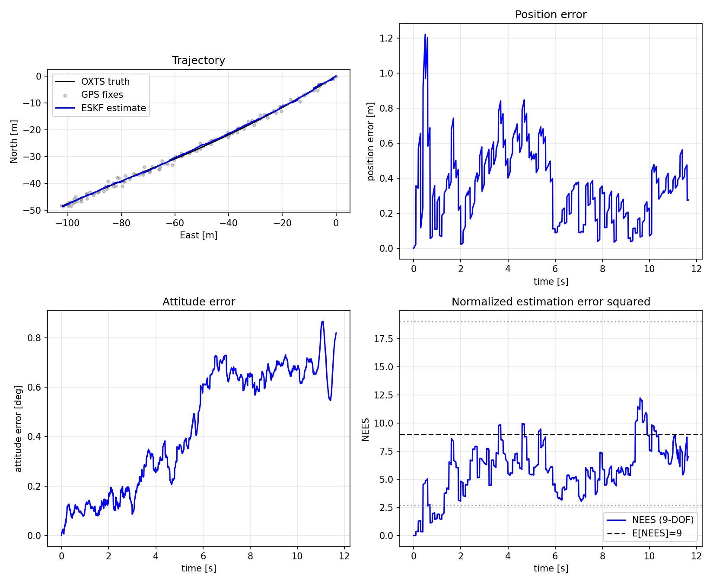
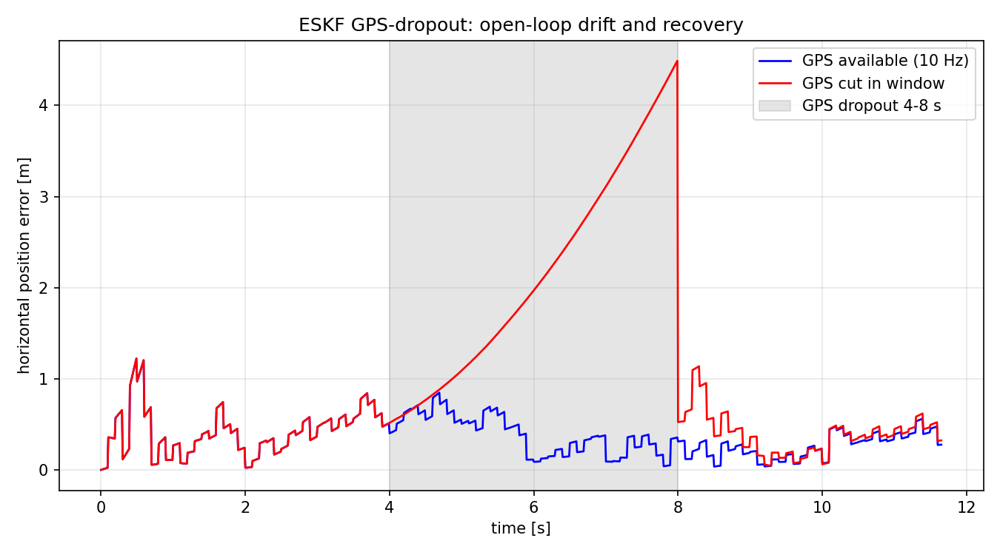
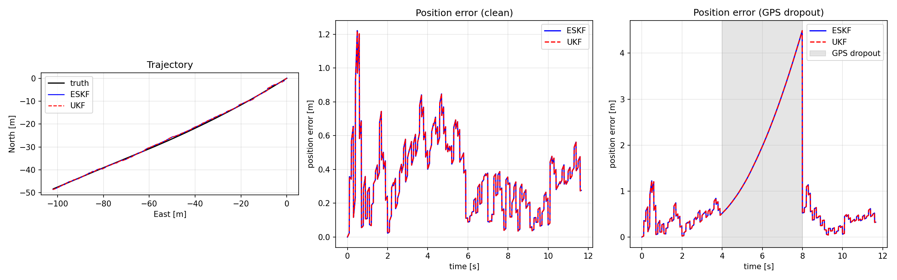

# Inertial Navigation on KITTI: Error-State EKF (and a UKF counterpart)

A loosely-coupled inertial navigation system (INS) fusing the KITTI Raw OXTS
inertial stream with GPS position, built as a 15-state error-state EKF (ESKF)
and cross-checked against a full-state unscented filter (UKF). This note collects
the results: trajectory accuracy, filter consistency, behavior through a GPS
dropout, and the design question of *why* an error-state formulation is the right
default for INS.

## Setup

- **Data:** KITTI Raw `2011_09_26` drive `0001`, unsynced high-rate OXTS extract
  (~100 Hz, 11.6 s, 1166 samples). The OXTS unit provides body-frame specific
  force and angular rate (the IMU stream) plus a WGS84 fix converted to a local
  ENU `map` frame anchored at the first sample.
- **Predict:** strapdown mechanization of the nominal pose at the full IMU rate.
- **Update:** GPS position at 10 Hz (every 10th IMU sample), modeled as the OXTS
  ENU position plus seeded `N(0, sigma^2)` noise with `sigma = 0.75 m` (a
  DGPS-grade receiver). The same `sigma` feeds both the injected noise and the
  measurement covariance `R`, so the consistency metrics stay honest.
- **State:** `[p, v, q, b_a, b_g]` — position, velocity, attitude quaternion,
  accelerometer bias, gyro bias. The ESKF estimates the 15-dim *error* about this
  nominal; the UKF carries the same 15 error dimensions through sigma points.

## Trajectory and error

Over the drive the ESKF tracks the OXTS reference to **0.41 m** horizontal
position RMSE and **0.51 deg** attitude RMSE (5-seed mean). The open-loop
strapdown alone drifts only ~0.25 deg in attitude over this drive, so the
attitude error is dominated by the filter's response to GPS noise, not by raw
gyro integration — see the dropout section for what happens when GPS is removed.

## Consistency (NEES)

Consistency is checked with the normalized estimation error squared (NEES) on the
9-DOF observable error `[dp, dv, dtheta]` against the corresponding block of `P`
(the true IMU biases are not in the KITTI ground truth, so they are excluded).
For a consistent filter NEES should sit inside the chi-squared 95% band for 9
degrees of freedom.

- **NEES 95%-band fraction: 0.94** (94% of post-burn-in steps fall inside the
  band) — at the consistency target.
- **Mean NEES: ~6.1** against an ideal of 9, i.e. the filter is slightly
  *conservative* (its covariance is a touch larger than the actual error), which
  is the safe direction to err for a navigation filter.

The NEES panel in the figure above shows the per-step trace against the band.

## GPS dropout: drift and recovery

To probe dead-reckoning behavior, GPS is cut for a 4 s window mid-drive (4–8 s)
while the IMU predict keeps running.

- During the cut the estimate runs open-loop on the IMU alone and drifts to a
  **peak ~4.5 m** horizontal error by the end of the 4 s window (error grows
  roughly quadratically as velocity and attitude errors integrate into position).
- The instant GPS returns, the next update snaps the error back **under 0.5 m
  within ~0.5 s**, and the filter resumes its ~0.4 m tracking.
- Over the whole drive the dropout raises position RMSE from **0.41 m to 1.51 m**
  — the entire penalty is localized to the gap and its short recovery.

This is the expected loosely-coupled signature: bounded accuracy while GPS is
present, graceful (not catastrophic) open-loop drift during a short outage, and
fast re-convergence on the first fix back.

## Error-state EKF vs. unscented KF

The same problem was run through a full-state UKF (USQUE-style: sigma points in
the error tangent space, lifted onto the quaternion manifold by `boxplus`,
propagated through the identical strapdown, brought back by `boxminus`). Tuning
is shared — the UKF config embeds the ESKF config — so this is a fair head-to-head.

| metric | ESKF | UKF |
| --- | --- | --- |
| position RMSE [m] | 0.410 | 0.410 |
| attitude RMSE [deg] | 0.512 | 0.512 |
| runtime [s] | ~0.4 | ~6.5 |

The two filters agree to three decimals (max trajectory difference < 1 mm), and
the UKF runs **~25x slower** because it propagates 31 sigma points through the
strapdown each step versus the ESKF's single analytic Jacobian. On this
near-linear INS problem the extra sampling buys nothing. The UKF would only earn
its cost under strong nonlinearity — large attitude uncertainty or much coarser
update rates — which this 100 Hz / 10 Hz setup does not exhibit.

## Why error-state, and not full-state, for INS?

The state contains an attitude that lives on the rotation manifold SO(3), not in
a flat vector space. A full-state EKF would have to carry that attitude directly,
and every option is bad:

- **A 3-parameter attitude** (Euler angles, rotation vector) has singularities —
  gimbal lock — where the covariance becomes meaningless.
- **A 4-parameter quaternion** is over-parameterized: it has a unit-norm
  constraint the EKF's `(n x n)` covariance cannot represent, so the filter
  fights its own normalization and the covariance drifts off the constraint
  surface.

The error-state formulation sidesteps both. It keeps the full nonlinear pose as a
**nominal** quaternion on the manifold and runs the EKF only on a small **error**
that lives in the flat tangent space `R^15`. This gives three concrete wins:

1. **No singularities, no constraints.** The error attitude is a 3-vector with a
   well-defined `3x3` covariance; the unit quaternion is maintained exactly by the
   nominal state, outside the linear-algebra.
2. **Tight linearization.** The error is kept near zero — injected back into the
   nominal and reset after every update — so the Jacobians are evaluated where the
   first-order approximation is most accurate. A full-state filter linearizes
   about a possibly-large attitude, where the approximation is worse.
3. **Cheap, exact Jacobians.** Because the dynamics are expressed in the error,
   the predict and measurement Jacobians are small closed-form expressions
   (verified here against finite differences), and the covariance update is a
   standard linear EKF step.

The UKF comparison reinforces the point from the other side: a sampling filter
that avoids Jacobians altogether produces the *same* answer at ~25x the cost, so
the linearization the ESKF performs is not the accuracy bottleneck. For INS — a
mildly nonlinear, high-rate problem with an attitude on a manifold — the
error-state EKF is the right default: it is singularity-free, consistent, and
the cheapest filter that hits the accuracy target.
