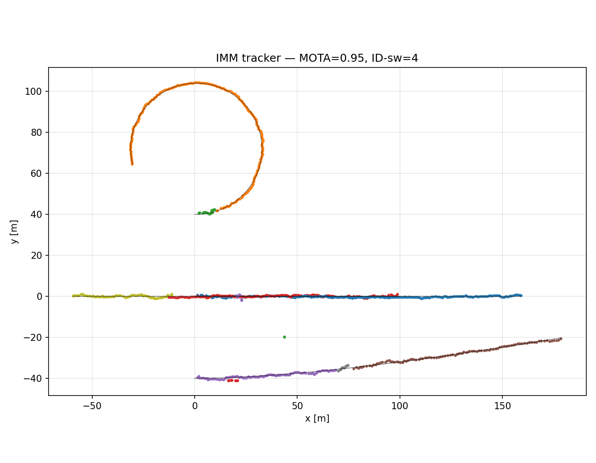

# IMM Multi-Target Tracker (synthetic)

The project's "where are they" half: an IMM filter per track, GNN data association, and an
M-of-N / max-age lifecycle, proven on a synthetic multi-target scenario before any KITTI or
C++ work.

## What it does
- Per-track IMM (CV + CA + CT±ω bank) lifted from `imm_synthetic.py`; a `legacy` config
  reproduces that prototype exactly (parity test to 1e-9), a `tracker` config adds the ω-bank
  and a missed-detection coast path.
- χ²-gated Mahalanobis association (gate ≈ 9.21, χ² 0.99 at 2 DOF) solved with the Hungarian
  algorithm (AB3DMOT-style greedy fallback available).
- M-of-N birth (M=3) rejects clutter; max-age death (3 misses) prunes lost tracks;
  confirmed-only output.

## Scenario
4 targets over 200 frames at 10 Hz: two constant-velocity targets (A, B) engineered to cross
at x≈50 m, one coordinated-turn target (ω=0.25 rad/s), one constant-acceleration target.
Detection probability p_detect=0.9 (missed detections), Poisson clutter λ=2 points/frame.
Detections are unlabeled 2D positions, shuffled per frame.

## Results (py-motmetrics)
MOTA=0.946, MOTP=0.522 m, IDF1=0.762, ID-switches=4 on the demo seed. Knobs: gate=9.21,
min_hits=3, max_age=3, ω-bank=±0.25 rad/s, clutter λ=2. The few switches are dominated by the
engineered A/B crossing, where two position-only detections at identical y are genuinely
ambiguous to a GNN gate.

Single-seed metrics on this scenario are noisy — over 12 seeds the means are MOTA=0.947,
MOTP=0.578 m, IDF1=0.850, ID-switches=4.1. The demo seed happens to be a below-average one for
IDF1, so read the seed-0 headline as an illustration, not as the scenario's expected value.

### Correction (2026-07-27)
Earlier numbers on this page were MOTA=0.944 / MOTP=0.543 / IDF1=0.834 / switches=3. They were
produced with a bug in `imm_synthetic.ref_to_ca`, which inflates the 4-state reference
`[x, y, vx, vy]` into the 6-state CA layout: it permuted the covariance block with
`np.ix_([0,2,1,3], ...)` while `ref_from_ca` deflated with a plain `p[:4,:4]` slice, so the
round trip was not the identity — var(y) and var(vx) were swapped every mixing step. The CA
mode therefore ran with a wrong innovation covariance and a wrong likelihood, biasing the IMM
mode probabilities. Fixed to a plain block copy; `test_filter_invariants.py` now pins both the
round trip and the CA state layout. Effect over 12 seeds: MOTP −0.031 m, IDF1 +0.026,
ID-switches 5.0 → 4.1.

On the Stage 0.5 scenario the standalone CA filter improves ~13% while the combined IMM barely
moves, because mixing was already down-weighting the broken mode — 24-seed means:

| | rmse_ca | rmse_imm |
|---|---|---|
| pre-fix | 1.0176 | 0.6421 |
| post-fix | **0.8854** | 0.6324 |

Reproduce with (the `old` shim restores the pre-fix permutation):

```bash
cd prototypes/python && python3 -c "
import numpy as np, imm_synthetic as im
from imm_synthetic import ImmScenarioConfig, run_single_trial
def old(x_ref, p_ref):
    x = np.zeros(im.CA_DIM); x[:4] = np.asarray(x_ref, float).ravel()[:4]
    p = np.diag([1.,1.,1.,1.,0.5,0.5]) * 10.0
    p[np.ix_([0,2,1,3],[0,2,1,3])] = np.asarray(p_ref, float)
    return x, p
for tag, fn in (('pre-fix', old), ('post-fix', im.ref_to_ca)):
    im.ref_to_ca = fn
    r = np.array([[run_single_trial(ImmScenarioConfig(), seed=s)[k]
                   for k in ('rmse_imm','rmse_ca')] for s in range(24)])
    print(tag, 'rmse_ca=%.4f rmse_imm=%.4f' % (r[:,1].mean(), r[:,0].mean()))"
```

The 1e-9 IMM parity test did not catch the bug: both sides of that comparison call the same
`ref_to_ca`.



## Why a fixed-ω CT bank, not estimated CTRV
Model competition handles the unknown turn rate while keeping the parity oracle against
`imm_synthetic.py` clean and the per-mode filters unchanged. Estimated CTRV (turn rate as a
state) is a noted future ablation; the ω-grid gap between bank members is its motivation.

## Note for the C++ port
Evaluation must snapshot each track's `(id, position)` at the frame it is produced — `Track`/IMM
state mutates in place, so holding references and reading positions after the run yields every
track's final state (a bug caught and fixed during this build). Stage 5's `kf_tracker` evaluator
faces the same trap.

## Next
KITTI Tracking (real 3D boxes, 3D-IoU association, an AB3DMOT comparison) — Stage 5 prep — then
the C++ ROS2 port (`kf_tracker`).
